# Ipharm Android Application with Java
An Android application designed to prepare medication solutions with specific calculations, featuring a database management system for medications and clients

##Presentation of the Activities (Interfaces) of the Application
1. On the first launch of the application, the initial interface displays a message that says "Hello". This message moves upwards after a moment with a splash animation and then shows the application's home page. The home page contains the name of the application and four icons. It allows users to view the list of patients, the list of medications, calculate, and see the list of remnants.
  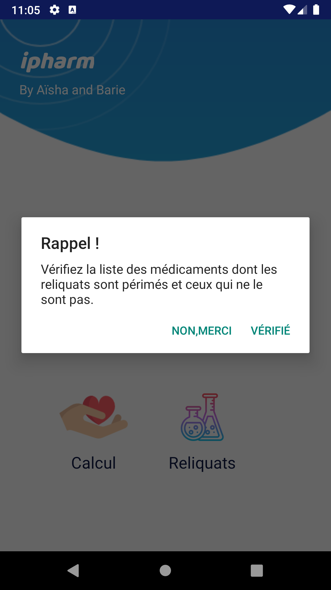

2. At the beginning of each workday, display a reminder and ask the pharmacist to check the list of medications for those that are expired and those that are not.

    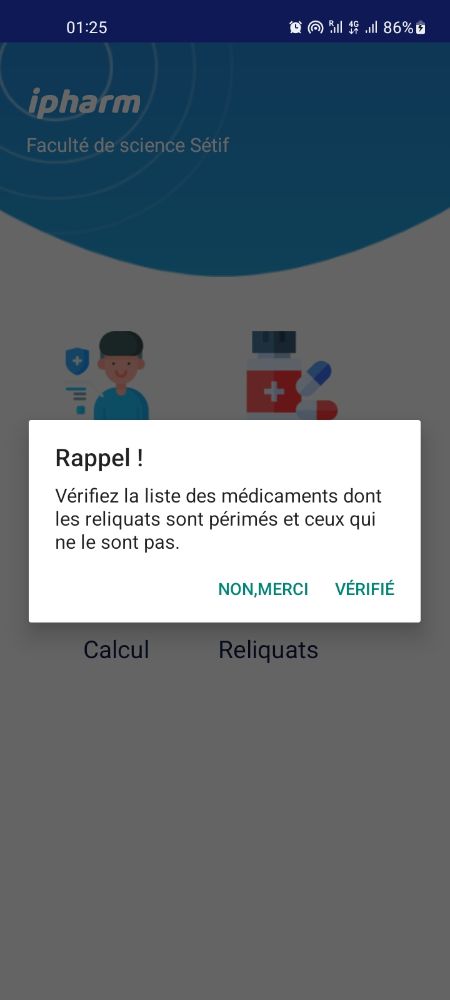 
   If the pharmacist clicks on 'Verify', the page containing the list of remaining medications should be displayed, and if they click on 'No, Thank You', the reminder will disappear, and the homepage will be displayed.

3. It offers users (Pharmacists) 4 choices: View Patients, View Medications, View Remaining Medications, and Perform Calculations. We start on the Patients page. When the user clicks on the 'Patients' icon, the Patients page opens, and for the first time, the list of patients will be empty. From this page, the user can add a new client by clicking the add button at the bottom right of the page or searching for a client via the search bar at the top of the page.
 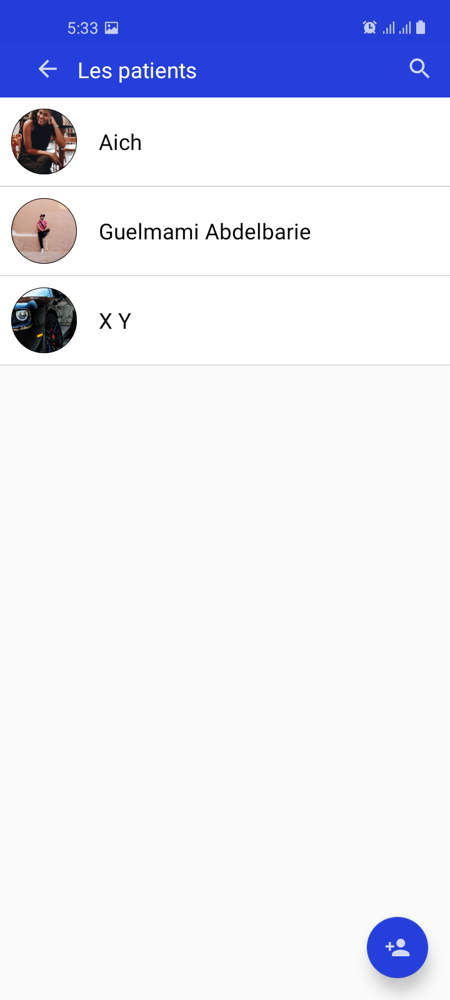 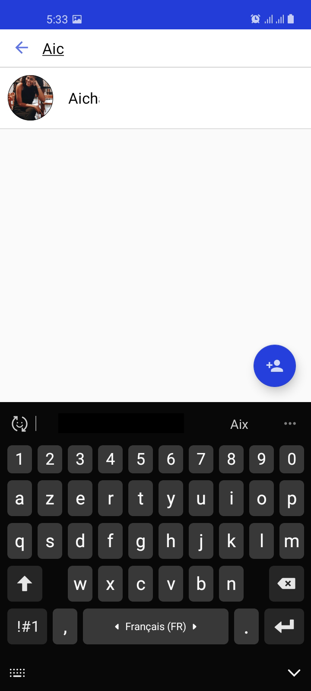 

4. If the user presses the button to add a new client, the Add Client (Patient) page opens, and they can fill in the client's information. Additionally, if they want to add a photo from the phone's (tablet's) storage or take a photo of the client on the spot using the camera, they just need to press the camera icon.
 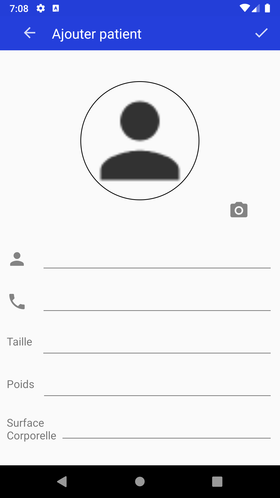 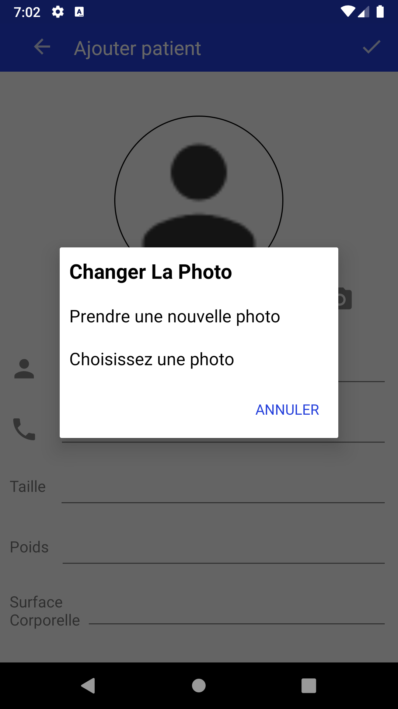 
To save the new patient, press the check mark at the top. To cancel the registration, press the back button to return to the previous page.

5. And if the user presses on a client, the page for that patient opens and contains additional information about the patient. From this page, the user can also modify or delete the client, as well as call or send a message to the client through the phone line.
 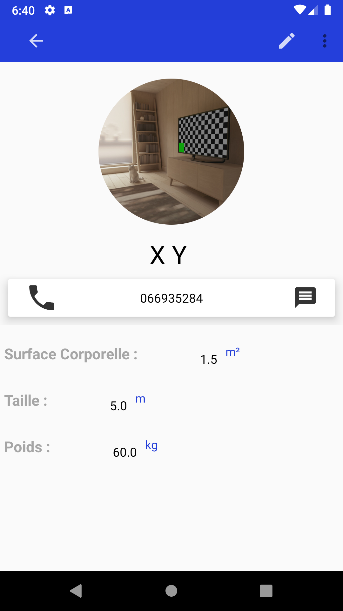 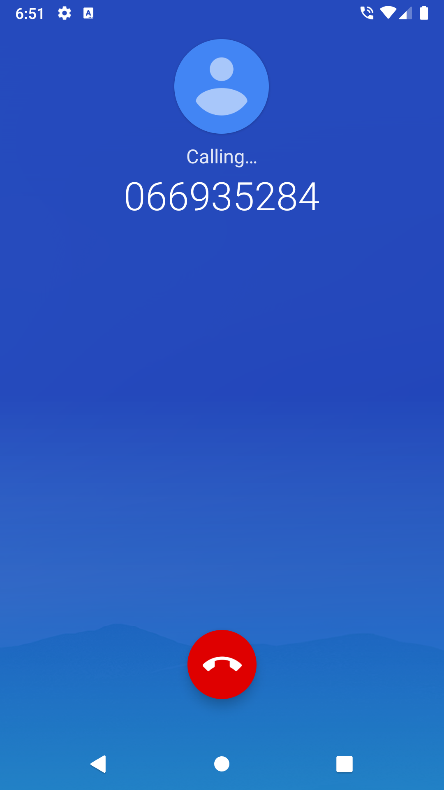 
 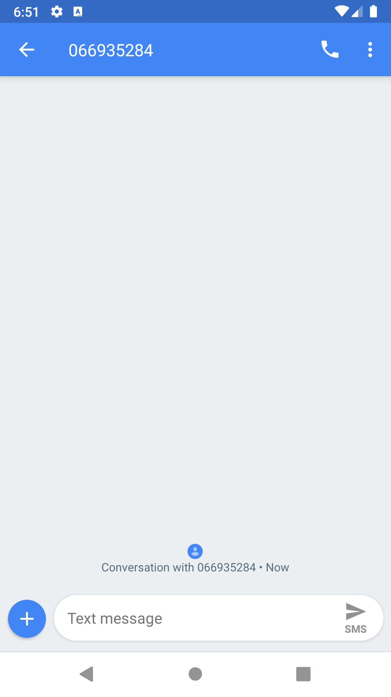  
 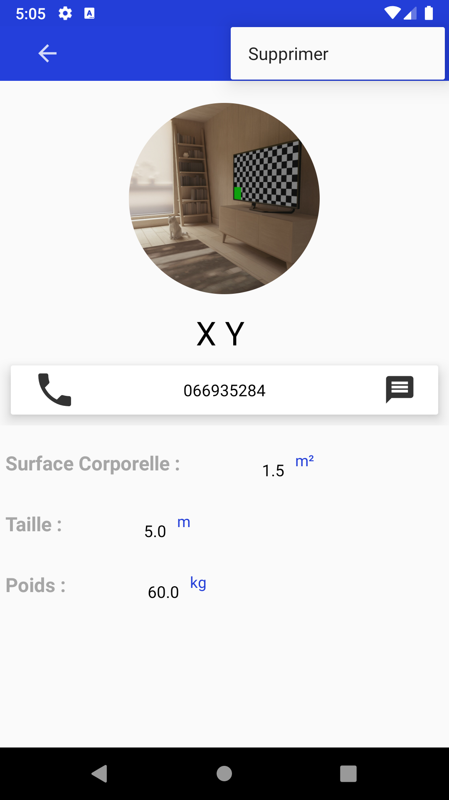 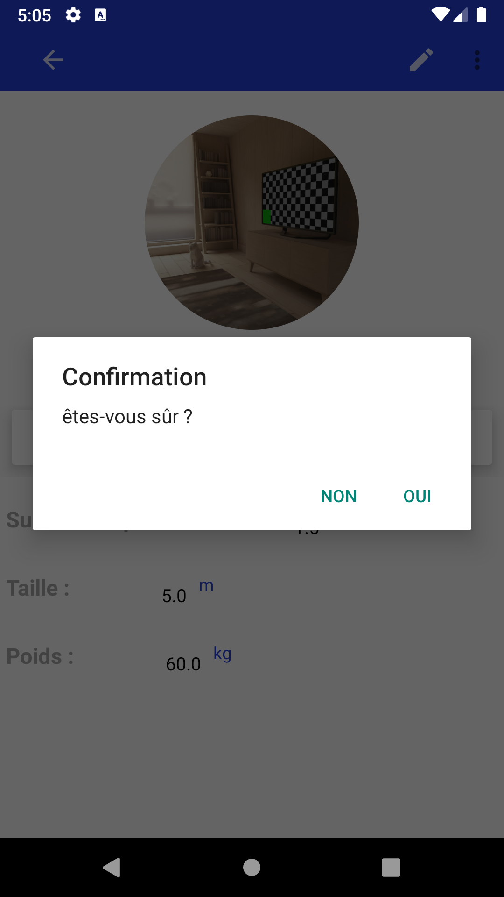 
 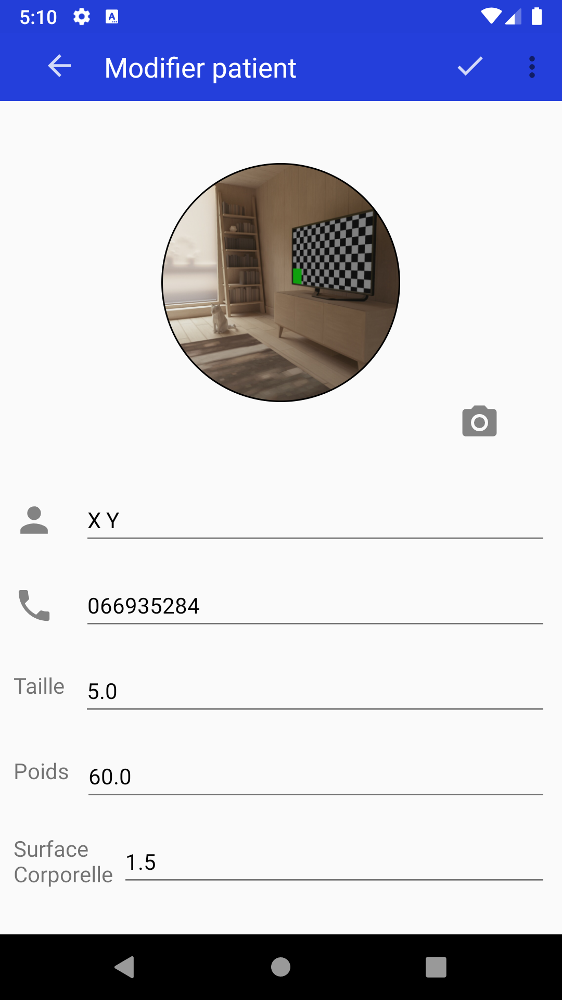 

6. The same applies to the Medications page with a few small changes.

When the user clicks on the 'Medications' icon, the Medications page opens. The list may initially be empty. From this page, the user can add a new medication by clicking the add button at the bottom right of the page or search for a medication via the search bar at the top of the page.

If the user presses the button to add a new medication, the Add Medication page opens, and they can fill in the medication's information. Additionally, if they want to add a photo from the phone's (tablet's) storage or take a photo on the spot using the camera, they just need to press the camera icon.

To save the new medication, press the check mark at the top. To cancel the registration, press the back button to return to the previous page.

 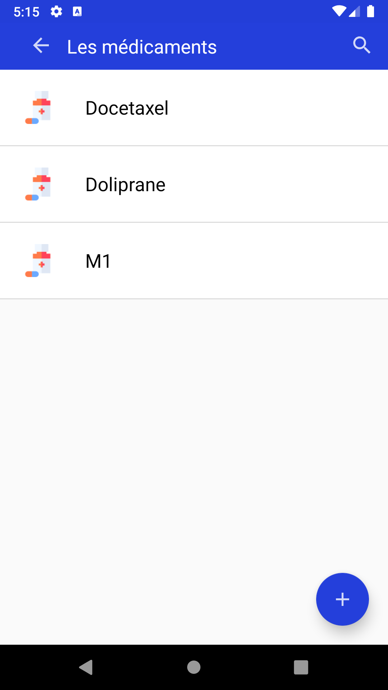 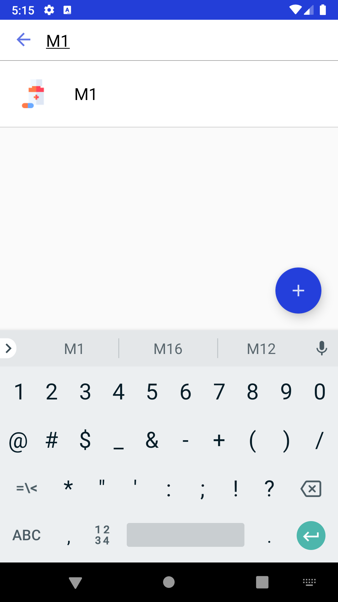 

From the main Medications page, the user (Pharmacist) can add a medication.

 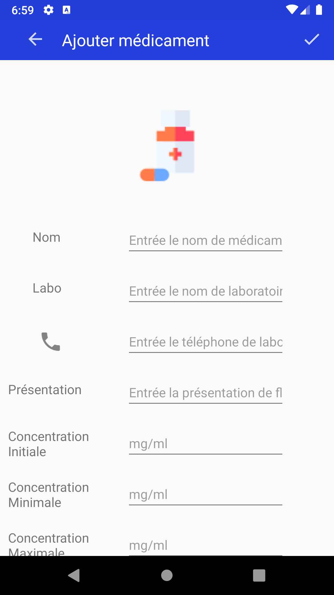 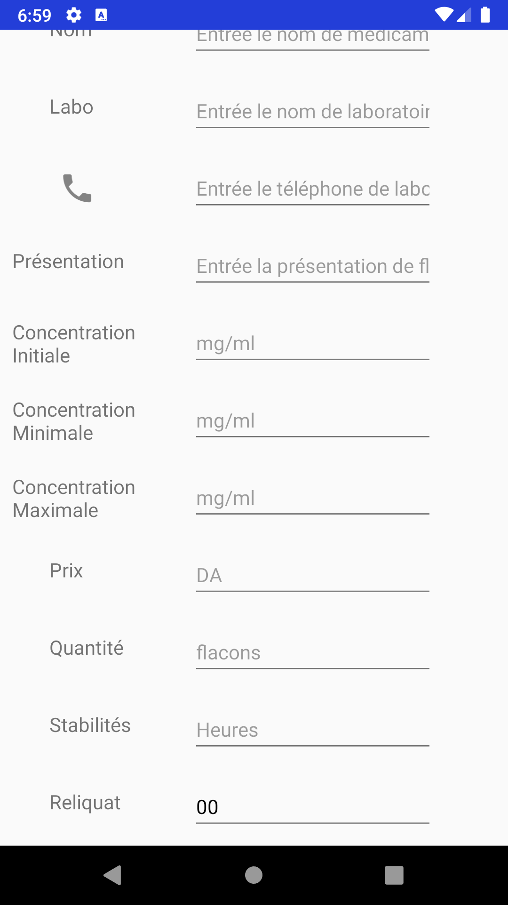 

When the pharmacist wants to view a particular medication, this is the interface they get:

 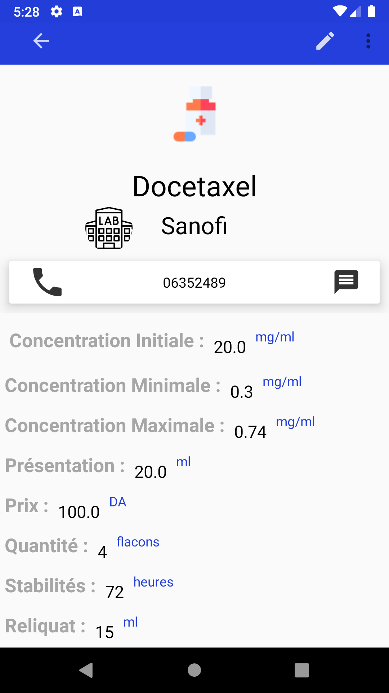 

On this interface, the pharmacist will have the following options:

* Call the Manufacturer: The pharmacist can call the laboratory that manufactures the medication.
* Send a Message: The pharmacist can send a message to the manufacturer through the phone line.
* Modify the Medication: The pharmacist can edit the information of the medication.
* Delete the Medication: The pharmacist can delete the medication from the list.

     

